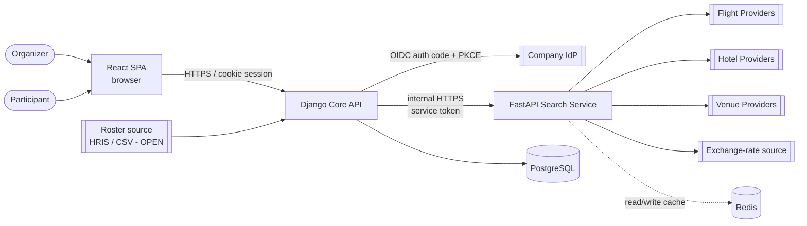
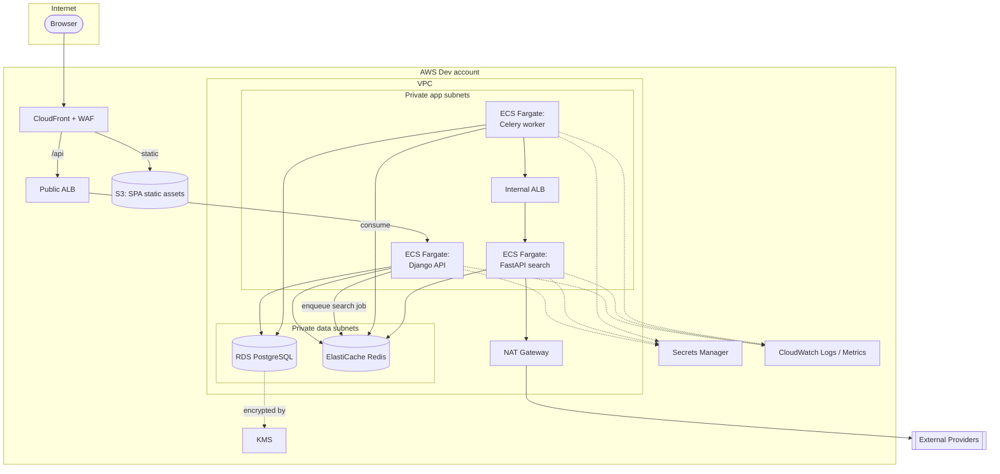
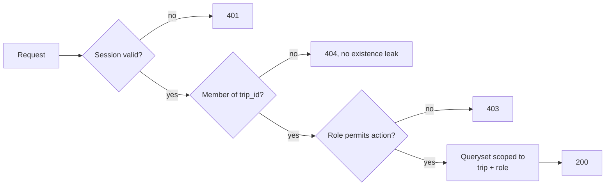
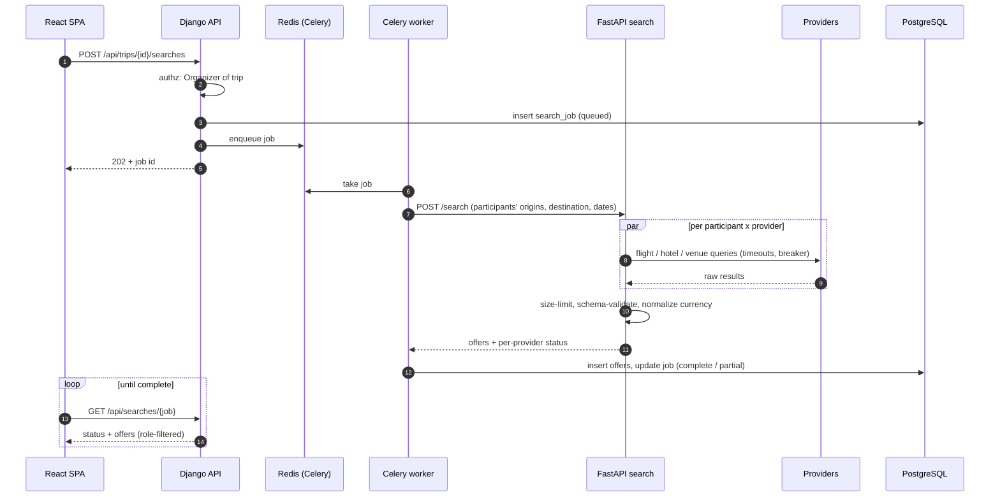
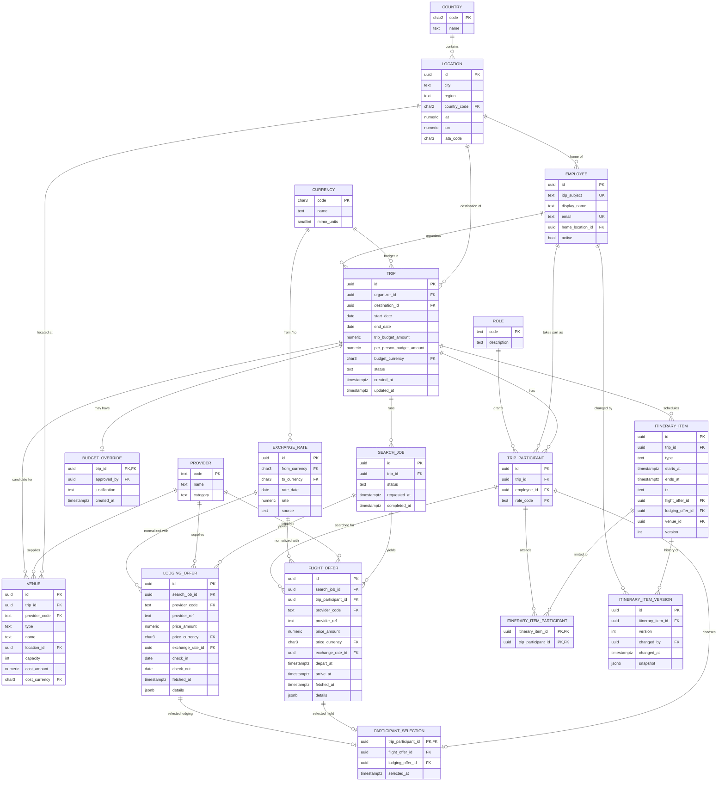
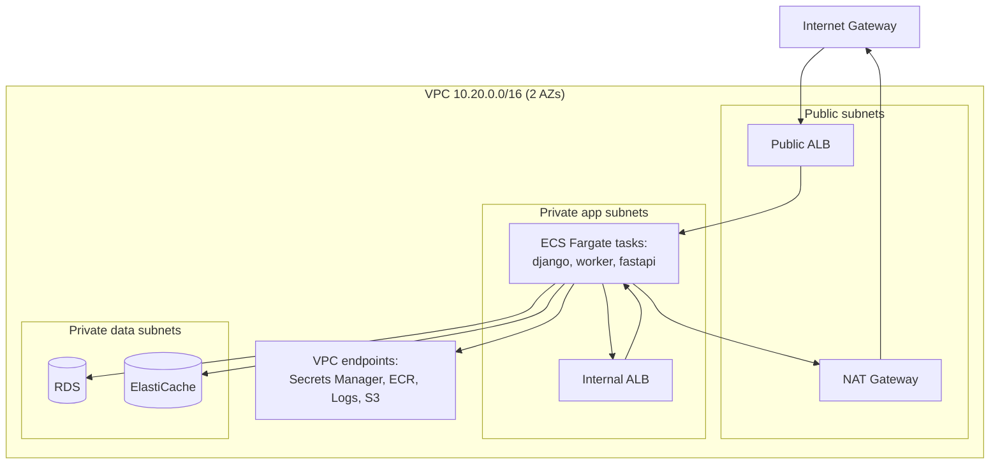

# ARCHITECTURE.md: offsiteiq System Architecture

Version: 0.1 (draft, 2026-10-01)
Status: DRAFT. Derived from [REQUIREMENTS.md](REQUIREMENTS.md) and [DESIGN.md](DESIGN.md). Where this document and REQUIREMENTS.md disagree, REQUIREMENTS.md wins. Requirement IDs (for example `SEC-AUTHZ-04`) are cited where an architectural decision exists to satisfy one. Items marked `OPEN` need confirmation before implementation.

Diagrams use [Mermaid](https://mermaid.js.org/) and render natively on GitHub.

## 1. Overview

offsiteiq is split into four runtime parts:

| Part | Technology | Responsibility |
|---|---|---|
| Web front end | React (TypeScript) | Single-page app for Organizers and Participants. Presentation only; never the authority for access decisions. |
| Core API | Django + Django REST Framework (Python) | System of record. Authentication (OIDC), authorization, trips, participants, budgets, venues, itinerary, audit history, admin. Owns the database schema and migrations. |
| Search service | FastAPI (Python, asyncio) | Concurrent fan-out to flight, hotel, and venue Providers. Validates, normalizes, and caches Provider results. Internal only. |
| Database | PostgreSQL (3NF schema) | Durable relational store for all application data. |

Everything runs in a dedicated **AWS Dev account** for v1 development (section 6).

### Why both Django and FastAPI

The two Python services are split by workload, not by preference:

- **Django** is a good fit for the transactional, permission-heavy core: a mature ORM with migrations, a built-in admin, strong CSRF/session defaults, and DRF's permission classes for object-level authorization (`SEC-AUTHZ-*`).
- **FastAPI** is a good fit for the I/O-bound search path: native `async`, Pydantic schema validation of untrusted Provider payloads (`SEC-INPUT-01`, `SEC-INTEG-04`), and cheap concurrency for the 50-participant, 30-second target (`NFR-PERF-01`).

Keeping Provider integrations in a separate service also isolates Provider credentials and third-party failure modes from the system of record (`SEC-INTEG-01`, `SEC-INTEG-03`, `NFR-AVAIL-01`).

**Rule:** the browser talks only to the Django API. The FastAPI service is not exposed to the internet and trusts only calls from Django.

## 2. System context



## 3. Container view



Serving the SPA and the API from the same CloudFront origin keeps the session cookie first-party and `SameSite=Lax` workable (`SEC-AUTH-03`) without CORS.

## 4. Components

### 4.1 Web front end (React)

| Concern | Choice |
|---|---|
| Language / build | TypeScript (strict), Vite |
| Routing | React Router |
| Server state | TanStack Query (caching, retries, polling of search jobs) |
| Forms / validation | React Hook Form + Zod (UX only; the server re-validates everything) |
| UI | Design tokens and components from [DESIGN.md](DESIGN.md); Inter; WCAG 2.2 AA |
| Dates / money | Temporal-style handling via `date-fns-tz`; money as decimal strings, never JS `number` (`FR-TRIP-06`) |
| Testing | Vitest + React Testing Library; Playwright for end-to-end; axe for accessibility |

Notes:

- No tokens in `localStorage` or JS-readable storage. The SPA relies on the HttpOnly session cookie set by Django (`SEC-AUTH-03`).
- Django sets a CSRF cookie; the SPA echoes it in an `X-CSRFToken` header on unsafe methods.
- Provider and venue text is rendered as text only. No `dangerouslySetInnerHTML` (`SEC-INPUT-04`). ESLint rule enforces this.
- Strict CSP with no `unsafe-inline` scripts, set at CloudFront.
- Role-based UI hiding (for example, hiding budgets from Participants) is cosmetic; the API omits the data (`SEC-AUTHZ-02`).

Source layout (proposed):

```
web/
  src/
    app/          routes, layout, providers
    features/     trips/, participants/, search/, venues/, itinerary/
    components/   shared design-system components
    api/          typed client generated from the Django OpenAPI schema
    lib/          money, time zone, formatting helpers
```

### 4.2 Core API (Django)

| Concern | Choice |
|---|---|
| Framework | Django 5.x LTS, Django REST Framework |
| Auth | OIDC authorization code + PKCE against the company IdP via `mozilla-django-oidc` or `authlib` (`SEC-AUTH-01`, `SEC-AUTH-02`). Server-side sessions in Redis. |
| Authorization | DRF permission classes plus queryset scoping by Trip membership and role on every view (`SEC-AUTHZ-04`) |
| Schema / client | `drf-spectacular` emits OpenAPI 3.1; the React client is generated from it |
| Background jobs | Celery with Redis broker for search orchestration, roster import, retention purge |
| Audit | Append-only itinerary version rows (`FR-ITIN-06`) |
| Admin | Django admin, restricted to an operator group, behind IdP auth |
| Testing | pytest-django, factory_boy, coverage gate at 80% (`NFR-TEST-01`) |

Django apps (bounded modules):

```
api/
  accounts/     Employee, IdP login, roles
  locations/    Location, geocoding adapter
  trips/        Trip, TripParticipant, budgets, override justification
  search/       SearchJob, offers, selection; client for FastAPI
  venues/       Venue
  itinerary/    ItineraryItem, versions, conflict detection, export
  money/        Currency, ExchangeRate, decimal helpers
  audit/        security event logging
```

Authorization model:



Participants receive serializers that exclude budget fields and other Participants' offers (`SEC-AUTHZ-02`, `SEC-AUTHZ-03`). Object IDs are UUIDv4 (`SEC-AUTHZ-05`).

### 4.3 Search service (FastAPI)

| Concern | Choice |
|---|---|
| Framework | FastAPI on Uvicorn, Python 3.12+ |
| HTTP client | `httpx.AsyncClient` with per-Provider timeouts and connection limits |
| Validation | Pydantic v2 models per Provider response; response size caps before parsing (`SEC-INTEG-04`) |
| Resilience | Per-Provider retry budget (`tenacity`) and circuit breaker (`SEC-INTEG-03`) |
| Cache | Redis, keyed by normalized query; stores `fetched_at` (`FR-SRCH-08`) |
| Auth (inbound) | Accepts only Django/worker calls: private network plus a short-lived signed service token. Not reachable from the internet. |
| Credentials | One Secrets Manager secret per Provider, least scope (`SEC-INTEG-01`, `SEC-INTEG-02`) |
| Testing | pytest + `respx` mocked contract tests with no network (`NFR-TEST-02`) |

Provider adapter interface (`FR-SRCH-07`):

```python
class FlightProvider(Protocol):
    name: str
    async def search(self, q: FlightQuery) -> list[FlightOffer]: ...

class LodgingProvider(Protocol):
    name: str
    async def search(self, q: LodgingQuery) -> list[LodgingOffer]: ...

class VenueProvider(Protocol):
    name: str
    async def search(self, q: VenueQuery) -> list[VenueResult]: ...
```

The service returns normalized offers. It does not write to PostgreSQL; the Celery worker persists results through Django models so the Django schema remains the single owner of the database.

### 4.4 Search flow



A failed Provider produces a `partial` job with the failure recorded, not a failed search (`NFR-AVAIL-01`).

## 5. Data tier (PostgreSQL, 3NF)

### 5.1 Principles

- **Third normal form.** Every non-key column depends on the key, the whole key, and nothing but the key. Lookup data (currencies, countries, providers, roles) lives in its own tables.
- **Derived values are not stored.** The normalized price is `price_amount * exchange_rate.rate`, computed in a view (`offer_normalized_v`), not stored alongside its inputs. The specific rate row used is referenced by FK, which satisfies `FR-SRCH-04` without a transitive dependency.
- **Money** is two columns, `amount numeric(12,2)` and `currency_code char(3) REFERENCES currency` (`FR-TRIP-06`).
- **Time** is `timestamptz` (UTC) plus an IANA `tz` column where the source zone matters (`FR-ITIN-04`).
- **Keys:** UUIDv4 surrogate primary keys on entity tables (`SEC-AUTHZ-05`); natural keys (ISO codes) on lookup tables.
- **Many-to-many** relationships use junction tables. The `participants: [UUID]` list from the REQUIREMENTS §7 sketch becomes `itinerary_item_participant`.
- **Polymorphic reference** (`ItineraryItem.ref`) is replaced by nullable FKs with a `CHECK` that exactly one is set, so referential integrity is enforced by the database.
- **Provider detail JSON** (`details jsonb`) is the one deliberate exception to strict 1NF: it holds schema-validated, display-only Provider fields that are never queried or joined. Anything we filter or compute on is promoted to a column.
- Access is through the Django ORM (parameterized; `SEC-INPUT-03`). Raw SQL is banned by lint rule except in reviewed migrations.

### 5.2 Entity-relationship diagram



### 5.3 Key constraints

| Table | Constraint | Satisfies |
|---|---|---|
| `trip` | `CHECK (end_date >= start_date)`; start-date-not-in-past checked in app (time-relative) | `FR-TRIP-02` |
| `trip` | `CHECK (trip_budget_amount > 0 AND per_person_budget_amount > 0)` | `FR-TRIP-03/04` |
| `trip_participant` | `UNIQUE (trip_id, employee_id)` | `FR-PART-02` |
| `exchange_rate` | `UNIQUE (from_currency, to_currency, rate_date, source)` | `FR-SRCH-04` |
| `flight_offer`, `lodging_offer` | `UNIQUE (provider_code, provider_ref, search_job_id)`; `fetched_at NOT NULL` | `FR-SRCH-03/08` |
| `itinerary_item` | `CHECK (num_nonnulls(flight_offer_id, lodging_offer_id, venue_id) <= 1)`; `CHECK (ends_at > starts_at)` | `FR-ITIN-01` |
| `itinerary_item_version` | Insert-only (DB role has no `UPDATE`/`DELETE`) | `FR-ITIN-06` |

Notes:

- `itinerary_item_participant` with no rows for an item means "all participants", matching REQUIREMENTS §7.
- `budget_currency` is shared by both Trip budgets. If budgets in different currencies are needed later, split into two FK columns.
- `employee.email` and `display_name` are sourced from the IdP; the IdP subject (`idp_subject`) is the join key, not email.
- Retention purge (`SEC-DATA-03`) is a scheduled Celery task that deletes Trips past the retention window; FKs cascade from `trip`.

### 5.4 Operational settings

- Amazon RDS for PostgreSQL 16, encrypted with a customer-managed KMS key (`SEC-DATA-02`), `rds.force_ssl = 1`.
- Separate DB roles: `app_migrator` (DDL, used only by the migration job), `app_rw` (Django and worker), `app_ro` (reporting). FastAPI has no DB credentials.
- Dev: single-AZ `db.t4g.medium`, 7-day automated backups, no public access.
- Migrations run as a one-off ECS task in the deploy pipeline before new app tasks start.

## 6. AWS Dev account

### 6.1 Account and access

- A dedicated **Dev** account in the company AWS Organization, separate from future Staging and Prod accounts. No production or real employee data in Dev; seed data is synthetic.
- Human access via IAM Identity Center (SSO) with MFA. No IAM users or long-lived access keys.
- CI deploys via GitHub Actions OIDC federation into a scoped deploy role.
- Region: `OPEN` (default `us-east-1`; depends on `SEC-DATA-05` residency answer).
- Baseline guardrails: CloudTrail (org trail), GuardDuty, AWS Config, Security Hub, IAM Access Analyzer, budget alarms.

### 6.2 Network



Security groups (allow-list, deny by default):

| Source | Destination | Port |
|---|---|---|
| CloudFront managed prefix list | Public ALB | 443 |
| Public ALB | Django tasks | 8000 |
| Django + worker tasks | Internal ALB → FastAPI tasks | 443 → 8001 |
| Django + worker tasks | RDS | 5432 |
| Django, worker, FastAPI tasks | ElastiCache | 6379 (TLS, AUTH) |
| FastAPI tasks | NAT → Providers | 443 |

### 6.3 Services used

| Need | AWS service |
|---|---|
| SPA hosting | S3 (private, OAC) + CloudFront |
| Edge protection | AWS WAF managed rule groups, rate limiting |
| Containers | ECR (image scanning on push), ECS on Fargate |
| Database | RDS for PostgreSQL |
| Cache / broker / sessions | ElastiCache for Redis (TLS, auth token) |
| Secrets | Secrets Manager (Provider keys, OIDC client secret, DB creds with rotation) |
| Encryption | KMS customer-managed keys |
| Certificates / DNS | ACM, Route 53 |
| Logs / metrics / alarms | CloudWatch; X-Ray or OpenTelemetry traces |
| Infrastructure as code | Terraform (or AWS CDK, `OPEN`), state in S3 with locking |

Dev cost controls: Fargate Spot for workers, single NAT Gateway, scale-to-zero schedule outside working hours.

## 7. Cross-cutting concerns

### 7.1 Security

| Control | Where |
|---|---|
| OIDC + PKCE, HttpOnly cookies | Django (`SEC-AUTH-*`) |
| Object-level authorization | Django permission classes and scoped querysets (`SEC-AUTHZ-*`) |
| Schema validation of untrusted input | DRF serializers (user), Pydantic (Providers) (`SEC-INPUT-01`) |
| Output encoding | React default escaping, DRF JSON renderer, structured logs (`SEC-INPUT-02`) |
| Secrets | Secrets Manager only; nothing in repo or `.env` files (`SEC-INTEG-01`) |
| Transport | TLS 1.2+ at CloudFront and ALBs; TLS to RDS and Redis (`SEC-DATA-02`) |
| Headers | CSP, HSTS, `X-Content-Type-Options`, `Referrer-Policy` via CloudFront response headers policy |
| Supply chain | Lockfiles (`uv`/`pip-tools`, `pnpm`), SBOM per build (CycloneDX), Dependabot (`SEC-INTEG-05`) |

### 7.2 Logging and observability

- JSON structured logs with a request ID propagated SPA → Django → worker → FastAPI.
- A log filter strips personal data, budgets, and credentials before emit (`SEC-DATA-04`).
- Security events (login, authz denials, budget override) go to a separate log group with longer retention.
- Dashboards: search latency p95 per Provider, circuit-breaker state, job partial-failure rate.

### 7.3 CI/CD

```mermaid
flowchart LR
    pr[Pull request] --> lint[Lint + typecheck]
    lint --> test[Unit + contract tests<br/>coverage >= 80%]
    test --> sast[SAST + dependency scan<br/>block high/critical]
    sast --> review[Human review]
    review --> merge[Merge to main]
    merge --> build[Build images + SBOM]
    build --> ecr[Push to ECR]
    ecr --> migrate[Run migrations task]
    migrate --> deploy[ECS rolling deploy to Dev]
    deploy --> smoke[Smoke + Playwright tests]
```



Gates map to `NFR-TEST-01`, `NFR-TEST-02`, `NFR-SEC-01`, and `NFR-REVIEW-01`.

### 7.4 Local development

`docker compose up` runs Postgres, Redis, Django, a Celery worker, FastAPI, and the Vite dev server, with a mock IdP and mock Providers so no external credentials are needed.

## 8. Repository layout (proposed)

```
offsiteiq/
  web/            React SPA
  api/            Django project
  search/         FastAPI service
  infra/          Terraform for the AWS Dev account
  docker-compose.yml
  ARCHITECTURE.md  DESIGN.md  REQUIREMENTS.md  README.md
```

## 9. Open architectural questions

1. Should search run synchronously for small Trips, or always through the job queue? (Default: always queued.)
2. Terraform or AWS CDK for infrastructure?
3. AWS region and data residency (blocked on `SEC-DATA-05`).
4. Exchange-rate source and refresh cadence (`FR-SRCH-04`).
5. Provider staleness window, which sets the Redis cache TTL (`FR-SRCH-08`).
6. Is Redis acceptable as the Celery broker, or should we use SQS?
7. Roster source (`FR-PART-04`): this decides whether a scheduled import job is needed.
