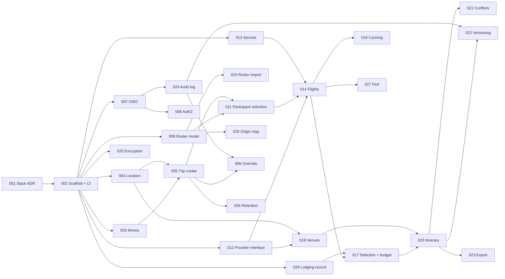

# BACKLOG.md: offsiteiq

Version: 0.2 (2026-10-01). Decomposed from REQUIREMENTS.md v0.3 using the
factory triage procedure. Changes in 0.2: the v1 trip profile was decided
(REQUIREMENTS section 2.3), so OIQ-015 and OIQ-016 are deferred, OIQ-028 and
OIQ-029 are new, and the affected tickets were re-scored.

Each ticket is one bounded change with testable acceptance criteria, traced
requirement IDs, dependencies, and a readiness score. The tickets are written
so they can be copied into Jira without rewording.

## Readiness scoring

Each ticket gets 0 to 2 points on six dimensions, using the factory-triage
rubric: acceptance criteria (AC), user outcome (Out), repository and owner
(Own), validation path (Val), dependencies and access (Dep), and rollback (RB).
The total is out of 12. A score of 10 to 12 is `ready`, 7 to 9 is `clarify`,
and 0 to 6 is `not ready`.

A score sets the order in which tickets get attention. It does not authorize a
merge or a deploy.

Two rules apply to every ticket today:

- **Own = 1.** The repository is confirmed, but no human owner is named. Name
  one in AGENTS.md and every ticket's Own score rises to 2.
- **Val = 1.** Validation is proposed but cannot run, because there is no stack
  or CI yet. When OIQ-002 lands, Val rises to 2 for every ticket whose tests
  run in CI.

The Dep score covers only blockers specific to that ticket. Every ticket also
waits on OIQ-001 and OIQ-002.

## Definition of done (all tickets)

- [ ] Every acceptance criterion has an automated test, or a recorded manual check where the ticket says one is acceptable.
- [ ] Line coverage stays at or above 80% (NFR-TEST-01).
- [ ] All input, from users and from Providers, is validated against an explicit schema before use (SEC-INPUT-01).
- [ ] Output to HTML, JSON, logs, and exports is contextually encoded (SEC-INPUT-02). Provider content is never rendered as HTML (SEC-INPUT-04).
- [ ] Database access uses parameterized queries only (SEC-INPUT-03).
- [ ] Every data access is authorized on the server by Trip membership and role (SEC-AUTHZ-04). This applies from OIQ-008 onward.
- [ ] Money uses fixed-point decimals, never floats (FR-TRIP-06).
- [ ] Logs contain no personal data, budgets, or credentials (SEC-DATA-04).
- [ ] No `OPEN` item was implemented with a default someone guessed.
- [ ] A human reviewed the change before merge (NFR-REVIEW-01).

## Summary

| ID | Title | Class | Score | Band | Blocked by |
|----|-------|-------|-------|------|------------|
| ~~OIQ-001~~ | Stack, hosting, and app surface decision | done | | | ARCHITECTURE.md |
| OIQ-002 | Repository scaffold and CI gates | feature | 9 | clarify | OIQ-001 |
| OIQ-003 | Money and currency primitives | feature | 9 | clarify | |
| OIQ-004 | Location model and destination resolution | feature | 7 | clarify | Q16 |
| OIQ-005 | Trip creation and validation | feature | 7 | clarify | Q22, Q23 |
| OIQ-006 | Budget override with justification | feature | 7 | clarify | Q6 |
| OIQ-007 | OIDC authentication and sessions | feature | 7 | clarify | Q11, Q15 |
| OIQ-008 | Roles, Trip membership, and object access | feature | 8 | clarify | Q24 |
| OIQ-009 | Employee roster model | feature | 9 | clarify | |
| OIQ-010 | Roster import | feature | 4 | not ready | Q5 |
| OIQ-011 | Participant selection | feature | 8 | clarify | Q4 |
| OIQ-012 | Provider interface, resilience, and mocks | feature | 9 | clarify | |
| OIQ-013 | Provider secrets management | feature | 9 | clarify | |
| OIQ-014 | Flight search per Participant | feature | 9 | clarify | Q2 (real Providers only) |
| ~~OIQ-015~~ | Hotel search | deferred | | | DEC-07: hotel pre-booked |
| ~~OIQ-016~~ | Currency normalization | deferred | | | DEC-03: USD only |
| OIQ-017 | Option selection and budget checks | feature | 6 | not ready | Q18, Q28 |
| OIQ-018 | Provider result caching | feature | 8 | clarify | Q12 |
| OIQ-019 | Venue search | feature | 8 | clarify | Q3 (real Providers only) |
| OIQ-020 | Itinerary assembly and views | feature | 7 | clarify | Q27 |
| OIQ-021 | Conflict detection | feature | 9 | clarify | |
| OIQ-022 | Itinerary versioning | feature | 9 | clarify | |
| OIQ-023 | Itinerary export | feature | 5 | not ready | Q7 |
| OIQ-024 | Security audit logging | feature | 9 | clarify | |
| OIQ-025 | Encryption in transit and at rest | feature | 9 | clarify | |
| OIQ-026 | Data retention | feature | 3 | not ready | Q8 |
| OIQ-027 | Search performance at participant ceiling | test | 6 | not ready | Q9 |
| OIQ-028 | Pre-booked lodging record | feature | 7 | clarify | Q28 |
| OIQ-029 | Participant origin map (Google Maps) | feature | 9 | clarify | Jim's `web/` scaffold |

No ticket is `ready` yet. ARCHITECTURE.md closes OIQ-001. Once OIQ-002
scaffolds the repo and CI, OIQ-003, 009, 012, 013, 014, 021, 022, 024, 025, and
029 reach 10 and become `ready`.

## Dependency order

Tickets in the same wave can run in parallel. Arrows show what each ticket
waits on.

These tickets must run one at a time, because each pair shares a schema or a
boundary:

- OIQ-003 and OIQ-005 both touch the Money type.
- OIQ-017 and OIQ-028 both write lodging cost into the budget totals.
- OIQ-020 and OIQ-022 share the ItineraryItem schema and its version field.

---

## Tickets

### OIQ-001 Stack, hosting, and app surface decision

- **Traces:** prerequisite for all requirements
- **Class:** docs · **Depends on:** none
- **Status:** done. ARCHITECTURE.md (2026-10-01) sets the stack: Django + DRF core API, FastAPI search service, PostgreSQL, Redis and Celery, and a React SPA, all running in the AWS Dev account on ECS Fargate, with GitHub Actions for CI, Secrets Manager, and CloudWatch.
- **Acceptance criteria**
  - [x] The stack, hosting target, CI host, secrets manager, and log sink are named.
  - [x] The frontend framework is React, as ARCHITECTURE.md §4.1 specifies (Q31).

### OIQ-002 Repository scaffold and CI gates

- **Traces:** NFR-TEST-01, NFR-TEST-02, NFR-SEC-01, SEC-INTEG-05
- **Class:** feature · **Depends on:** OIQ-001
- **Acceptance criteria**
  - [ ] Running one command locally runs the full test suite. The command is recorded under "Declared checks" in AGENTS.md.
  - [ ] CI runs on every PR and fails when line coverage drops below 80%.
  - [ ] CI runs SAST and a dependency scan, and blocks merge on any high or critical finding. To verify, a seeded vulnerable dependency must fail the build.
  - [ ] Each build produces an SBOM and keeps it as a build artifact.
  - [ ] Tests run with outbound network access disabled. A test that tries a network call fails.
- **Readiness:** 9/12, clarify (AC 2 · Out 2 · Own 1 · Val 1 · Dep 1 · RB 2)
- **Next check:** choose the SAST and dependency-scan tools in ADR-001.

### OIQ-003 Money and currency primitives

- **Traces:** FR-TRIP-03, FR-TRIP-04, FR-TRIP-06, §7 Money
- **Class:** feature · **Depends on:** OIQ-002
- **Acceptance criteria**
  - [ ] Money has a decimal amount with 2 places and an ISO 4217 currency code.
  - [ ] Constructing Money without a currency fails. Any currency other than `USD` fails (DEC-03).
  - [ ] Binary floats are rejected as input. A lint rule or a test enforces this.
- **Readiness:** 9/12, clarify (AC 2 · Out 1 · Own 1 · Val 1 · Dep 2 · RB 2)
- **Next check:** none beyond OIQ-002.

### OIQ-004 Location model and destination resolution

- **Traces:** FR-TRIP-01, FR-PART-05, SEC-DATA-01, ARCHITECTURE.md §5 Location
- **Class:** feature · **Depends on:** OIQ-002 · **Blocked by:** Q16
- **Acceptance criteria**
  - [ ] Free text resolves to a canonical Location with city, region, ISO 3166-1 country, latitude and longitude, and an optional IATA code. Text that cannot be resolved is rejected with an error.
  - [ ] Text that matches more than one place returns the candidates for the user to choose from. It does not pick one silently.
  - [ ] The Location schema has no street-address field (FR-PART-05).
  - [ ] Geocoder responses are schema-validated as untrusted input. The geocoder is mocked in tests.
- **Readiness:** 7/12, clarify (AC 1 · Out 2 · Own 1 · Val 1 · Dep 0 · RB 2)
- **Next check:** answer Q16, which picks the geocoding source.

### OIQ-005 Trip creation and validation

- **Traces:** FR-TRIP-01 to FR-TRIP-04, FR-TRIP-05 (the rejection path only), §7 Trip
- **Class:** feature · **Depends on:** OIQ-003, OIQ-004 · **Blocked by:** Q22, Q23
- **Acceptance criteria**
  - [ ] A Trip needs a start date, end date, Trip Budget, and Per-Person Budget. The destination defaults to Nashville, TN (BNA) (DEC-01).
  - [ ] The start date is a Tuesday and the end date is the Thursday of the same week (DEC-04).
  - [ ] Boundary tests cover the date rules: end equal to start is accepted, end before start is rejected, start equal to today is accepted, and start before today is rejected. "Today" uses the time zone that Q22 decides.
  - [ ] A Trip where Per-Person Budget times Participant count exceeds the Trip Budget is rejected. The override path belongs to OIQ-006.
  - [ ] A new Trip starts with status `draft`. Status transitions follow the answer to Q23.
  - [ ] Trip IDs are UUIDv4.
- **Readiness:** 7/12, clarify (AC 1 · Out 2 · Own 1 · Val 1 · Dep 0 · RB 2)
- **Next check:** answer Q22, which decides the time zone for "today".

### OIQ-006 Budget override with justification

- **Traces:** FR-TRIP-05 (the override path), SEC-LOG-01
- **Class:** feature · **Depends on:** OIQ-005, OIQ-024 · **Blocked by:** Q6
- **Acceptance criteria**
  - [ ] An Organizer can override a budget rejection only by giving a non-empty justification.
  - [ ] Each override is logged with the actor, timestamp, Trip ID, and justification.
  - [ ] Who may approve an override follows the answer to Q6.
- **Readiness:** 7/12, clarify (AC 1 · Out 2 · Own 1 · Val 1 · Dep 0 · RB 2)
- **Next check:** answer Q6.

### OIQ-007 OIDC authentication and sessions

- **Traces:** SEC-AUTH-01 to SEC-AUTH-04
- **Class:** feature · **Depends on:** OIQ-002 · **Blocked by:** Q11, Q15
- **Acceptance criteria**
  - [ ] Login uses the OIDC authorization code flow with PKCE. Requests for the implicit flow are refused.
  - [ ] The app has no local password table or password field.
  - [ ] The session cookie is HttpOnly and Secure, with SameSite set to Lax or Strict. A test asserts these attributes.
  - [ ] Sessions expire after the idle timeout and after the absolute timeout from Q11. Tests use a fake clock.
  - [ ] Tests mock the IdP. The ticket also includes one manual check against the real IdP's test tenant.
- **Readiness:** 7/12, clarify (AC 2 · Out 2 · Own 1 · Val 1 · Dep 0 · RB 1)
- **Next check:** answer Q15, which names the IdP and whether a test tenant is available.

### OIQ-008 Roles, Trip membership, and object access

- **Traces:** SEC-AUTHZ-01 to SEC-AUTHZ-05
- **Class:** feature · **Depends on:** OIQ-007 · **Blocked by:** Q24
- **Acceptance criteria**
  - [ ] There are two roles, Organizer and Participant, scoped to each Trip.
  - [ ] A Participant requesting another Participant's travel details gets 403 or 404. An integration test covers every endpoint.
  - [ ] A non-member requesting any Trip resource gets 404.
  - [ ] Only an Organizer can see budgets and aggregate costs.
  - [ ] Every external ID is UUIDv4. Guessing a valid ID gives no access without membership.
- **Readiness:** 8/12, clarify (AC 2 · Out 2 · Own 1 · Val 1 · Dep 1 · RB 1)
- **Next check:** answer Q24. Multiple Organizers would change the membership model.

### OIQ-009 Employee roster model

- **Traces:** FR-PART-01, FR-PART-05, SEC-DATA-01, ARCHITECTURE.md §5 Employee
- **Class:** feature · **Depends on:** OIQ-002, OIQ-004
- **Acceptance criteria**
  - [ ] Each Employee has a UUID, display name, email, and home Location.
  - [ ] Home Location is stored only at city or airport precision. A test confirms that a street address is rejected.
  - [ ] The employee identifier is unique, enforced by a database constraint.
- **Readiness:** 9/12, clarify (AC 2 · Out 1 · Own 1 · Val 1 · Dep 2 · RB 2)
- **Next check:** none beyond OIQ-002.

### OIQ-010 Roster import

- **Traces:** FR-PART-04
- **Class:** feature · **Depends on:** OIQ-009 · **Blocked by:** Q5
- **Acceptance criteria**
  - [ ] To be written when Q5 is answered. Whatever the source, imported rows are schema-validated and invalid rows are reported, never skipped silently.
- **Readiness:** 4/12, not ready (AC 0 · Out 1 · Own 1 · Val 0 · Dep 0 · RB 2)
- **Next check:** answer Q5.

### OIQ-011 Participant selection

- **Traces:** FR-PART-02, FR-PART-03
- **Class:** feature · **Depends on:** OIQ-005, OIQ-009 · **Blocked by:** Q4
- **Acceptance criteria**
  - [ ] An Organizer can add and remove Employees as Participants on a `draft` Trip.
  - [ ] The default selection follows the answer to Q4.
  - [ ] Changing the Participant count re-runs the budget check from FR-TRIP-05.
- **Readiness:** 8/12, clarify (AC 1 · Out 2 · Own 1 · Val 1 · Dep 1 · RB 2)
- **Next check:** answer Q4.

### OIQ-012 Provider interface, resilience, and mocks

- **Traces:** FR-SRCH-07, SEC-INTEG-03, SEC-INTEG-04, SEC-INPUT-01, NFR-AVAIL-01, NFR-TEST-02
- **Class:** feature · **Depends on:** OIQ-002
- **Acceptance criteria**
  - [ ] Flight, hotel, and venue searches each go through one internal Provider interface.
  - [ ] At least two mock Providers per category implement the interface. Contract tests run with no network access.
  - [ ] Each Provider call has a timeout, a retry limit, and a circuit breaker. A test confirms that a hung mock Provider does not block the others.
  - [ ] Response bodies above a size limit are rejected before parsing. Responses that fail the schema are rejected and recorded as a Provider failure.
  - [ ] When one Provider fails, search returns the results from the rest and notes the failure.
- **Readiness:** 9/12, clarify (AC 2 · Out 1 · Own 1 · Val 1 · Dep 2 · RB 2)
- **Next check:** none beyond OIQ-002. This ticket unblocks OIQ-014, 015, and 019.

### OIQ-013 Provider secrets management

- **Traces:** SEC-INTEG-01, SEC-INTEG-02
- **Class:** feature · **Depends on:** OIQ-002 (Secrets Manager, per ARCHITECTURE.md §4.3)
- **Acceptance criteria**
  - [ ] Provider credentials are read from the secrets manager at runtime.
  - [ ] Secret scanning in CI fails the build if a credential pattern is committed.
  - [ ] Each Provider has its own credential. Sharing one credential across Providers is not possible by construction.
- **Readiness:** 9/12, clarify (AC 2 · Out 1 · Own 1 · Val 1 · Dep 2 · RB 2)
- **Next check:** none beyond OIQ-002.

### OIQ-014 Flight search per Participant

- **Traces:** FR-SRCH-01, FR-SRCH-03, FR-SRCH-09 to FR-SRCH-13, FR-PART-03
- **Class:** feature · **Depends on:** OIQ-011, OIQ-012, OIQ-013 · **Blocked by:** Q2, for real Providers only
- **Acceptance criteria**
  - [ ] Each Participant gets a search from their home Location to the destination, within the Trip dates.
  - [ ] Every option includes price, currency, Provider name, Provider reference, and fetch time.
  - [ ] Searches for different Participants and Providers run concurrently.
  - [ ] The default window is taken from the agenda: arriving Tuesday and departing Thursday after the activities. A user can widen it.
  - [ ] Each option shows its fit with the agenda, its time on site, and its number of stops. Users can filter to nonstop flights.
  - [ ] Red-eyes are labeled and still shown. A cheaper red-eye never outranks a comparable daytime flight on price alone. The red-eye threshold is a single configurable value until Q25 is answered.
  - [ ] An origin outside the continental US is rejected.
  - [ ] The ticket is complete against mock Providers. Integrating a real Provider is a separate ticket once Q2 is answered.
- **Readiness:** 9/12, clarify (AC 2 · Out 2 · Own 1 · Val 1 · Dep 1 · RB 2)
- **Next check:** none for the mock scope. Q25 and Q26 only adjust default values.

### OIQ-015 Hotel search (deferred: DEC-07)

The hotel is pre-booked for v1, and OIQ-028 records it. This ticket is kept for the time when hotel search returns to scope.

- **Traces:** FR-SRCH-02, FR-SRCH-03
- **Class:** feature · **Depends on:** OIQ-004, OIQ-012 · **Blocked by:** Q19, and Q2 for real Providers only
- **Acceptance criteria**
  - [ ] Searches cover the full date range at the destination.
  - [ ] Every option includes the same fields as OIQ-014.
  - [ ] The search request carries the occupancy model from Q19.
- **Readiness:** 7/12, clarify (AC 1 · Out 2 · Own 1 · Val 1 · Dep 0 · RB 2)
- **Next check:** answer Q19. Shared rooms change both the search request and how cost is attributed.

### OIQ-016 Currency normalization (deferred: DEC-03)

All v1 money is USD. This ticket is kept for the time when international travel returns to scope.

- **Traces:** FR-SRCH-04
- **Class:** feature · **Depends on:** OIQ-003 · **Blocked by:** Q17
- **Acceptance criteria**
  - [ ] Each option's price is converted to the Trip Budget currency, using the rate source and rate date from Q17.
  - [ ] The rate used and its date are stored on the option.
  - [ ] A test checks rounding on a known rate.
- **Readiness:** 7/12, clarify (AC 2 · Out 1 · Own 1 · Val 1 · Dep 0 · RB 2)
- **Next check:** answer Q17.

### OIQ-017 Option selection and budget checks

- **Traces:** FR-SRCH-05, FR-SRCH-06, §7 TripParticipant
- **Class:** feature · **Depends on:** OIQ-014, OIQ-028 · **Blocked by:** Q18, Q28
- **Acceptance criteria**
  - [ ] The user role from Q18 selects one round-trip flight option per Participant.
  - [ ] An option that would push a Participant over the Per-Person Budget is flagged before it is selected.
  - [ ] The running Trip total is shown to the Organizer and flagged when it exceeds the Trip Budget. It is flights only, or flights plus lodging, depending on the answer to Q28.
- **Readiness:** 6/12, not ready (AC 1 · Out 1 · Own 1 · Val 1 · Dep 0 · RB 2)
- **Next check:** answer Q18. No requirement currently covers selection, although the data model assumes it exists.

### OIQ-018 Provider result caching

- **Traces:** FR-SRCH-08
- **Class:** feature · **Depends on:** OIQ-014, OIQ-015 · **Blocked by:** Q12
- **Acceptance criteria**
  - [ ] Cached results keep their fetch timestamp, and the timestamp is shown wherever the result is shown.
  - [ ] Results older than the staleness window from Q12 are fetched again before they can be selected.
- **Readiness:** 8/12, clarify (AC 1 · Out 2 · Own 1 · Val 1 · Dep 1 · RB 2)
- **Next check:** answer Q12.

### OIQ-019 Venue search

- **Traces:** FR-VENUE-01 to FR-VENUE-04, SEC-INPUT-04
- **Class:** feature · **Depends on:** OIQ-004, OIQ-012 · **Blocked by:** Q3 for real Providers only
- **Acceptance criteria**
  - [ ] Meeting-space results include name, capacity, address, and indicative cost.
  - [ ] Entertainment results, such as restaurants and activities, include name, type, and address.
  - [ ] Results can be filtered to capacity at or above the Participant count.
  - [ ] Venue text is stored and rendered as text only. A test confirms an HTML payload is rendered inert.
- **Readiness:** 8/12, clarify (AC 1 · Out 2 · Own 1 · Val 1 · Dep 1 · RB 2)
- **Next check:** confirm the entertainment fields. FR-VENUE-02 does not list any.

### OIQ-020 Itinerary assembly and views

- **Traces:** FR-ITIN-01, FR-ITIN-02, FR-ITIN-04, §7 ItineraryItem
- **Class:** feature · **Depends on:** OIQ-017, OIQ-019 · **Blocked by:** Q27
- **Acceptance criteria**
  - [ ] Each Trip has one Itinerary holding its flights, lodging, meetings, and events in time order.
  - [ ] A Participant's view shows only their own travel and the shared events.
  - [ ] Times are stored in UTC along with their IANA zone, and displayed in destination local time. Tests cover a DST transition.
  - [ ] A new Trip is seeded from the 3-day agenda template (FR-ITIN-07): Tuesday arrival, the Wednesday workshop, and Thursday morning activities. Default times come from Q27.
- **Readiness:** 7/12, clarify (AC 1 · Out 2 · Own 1 · Val 1 · Dep 0 · RB 2)
- **Next check:** answer Q27, which sets the template's default times.

### OIQ-021 Conflict detection

- **Traces:** FR-ITIN-03
- **Class:** feature · **Depends on:** OIQ-020
- **Acceptance criteria**
  - [ ] Overlapping items for the same Participant are reported.
  - [ ] An event a Participant attends that starts before their arrival or ends after their departure is reported.
  - [ ] Back-to-back items that touch but do not overlap are not reported. A boundary test covers this.
- **Readiness:** 9/12, clarify (AC 2 · Out 2 · Own 1 · Val 1 · Dep 1 · RB 2)
- **Next check:** none beyond OIQ-020.

### OIQ-022 Itinerary versioning

- **Traces:** FR-ITIN-06, SEC-LOG-01
- **Class:** feature · **Depends on:** OIQ-020, OIQ-024
- **Acceptance criteria**
  - [ ] Every change to an Itinerary item creates a new version that records who changed what, and when.
  - [ ] Earlier versions can be read and are never modified in place.
- **Readiness:** 9/12, clarify (AC 2 · Out 2 · Own 1 · Val 1 · Dep 1 · RB 2)
- **Next check:** none beyond its dependencies.

### OIQ-023 Itinerary export

- **Traces:** FR-ITIN-05, SEC-INPUT-02
- **Class:** feature · **Depends on:** OIQ-020 · **Blocked by:** Q7
- **Acceptance criteria**
  - [ ] To be written when Q7 is answered. Whatever the format, an export contains only what the requesting user is allowed to see, and all content is encoded for that format.
- **Readiness:** 5/12, not ready (AC 0 · Out 2 · Own 1 · Val 0 · Dep 0 · RB 2)
- **Next check:** answer Q7.

### OIQ-024 Security audit logging

- **Traces:** SEC-LOG-01, SEC-LOG-02, SEC-DATA-04
- **Class:** feature · **Depends on:** OIQ-007 (CloudWatch, per ARCHITECTURE.md §7.2)
- **Acceptance criteria**
  - [ ] Logins, authorization failures, budget overrides, and Itinerary changes are logged with the actor, timestamp, and Trip ID.
  - [ ] The application's own credentials cannot modify or delete log entries.
  - [ ] A test scans log output for personal data, budget amounts, and credentials, and fails if any appear.
- **Readiness:** 9/12, clarify (AC 2 · Out 1 · Own 1 · Val 1 · Dep 2 · RB 2)
- **Next check:** none beyond OIQ-007.

### OIQ-025 Encryption in transit and at rest

- **Traces:** SEC-DATA-02
- **Class:** feature · **Depends on:** OIQ-002 (AWS, per ARCHITECTURE.md §5.4 and §7.1)
- **Acceptance criteria**
  - [ ] TLS 1.2 or later is enforced and TLS 1.3 is preferred. A test confirms that a TLS 1.1 connection is refused.
  - [ ] Datastore encryption at rest is enabled and recorded in the infrastructure configuration.
- **Readiness:** 9/12, clarify (AC 2 · Out 1 · Own 1 · Val 1 · Dep 2 · RB 2)
- **Next check:** none beyond OIQ-002.

### OIQ-026 Data retention

- **Traces:** SEC-DATA-03 (SEC-DATA-05 is answered: all Participants are in the US)
- **Class:** feature · **Depends on:** OIQ-005 · **Blocked by:** Q8
- **Acceptance criteria**
  - [ ] To be written when Q8 is answered. Deletion cannot be undone, so the ticket must include a dry-run mode and a test that data from an active Trip is never deleted.
- **Readiness:** 3/12, not ready (AC 0 · Out 1 · Own 1 · Val 0 · Dep 0 · RB 1)
- **Next check:** answer Q8.

### OIQ-027 Search performance at participant ceiling

- **Traces:** NFR-PERF-01
- **Class:** test · **Depends on:** OIQ-014, OIQ-015 · **Blocked by:** Q9
- **Acceptance criteria**
  - [ ] A load test searches the participant ceiling from Q9 against mock Providers with realistic latency, and finishes in 30 seconds or less.
  - [ ] The test runs in CI or on a schedule and records its result.
- **Readiness:** 6/12, not ready (AC 1 · Out 2 · Own 1 · Val 0 · Dep 0 · RB 2)
- **Next check:** answer Q9.

### OIQ-028 Pre-booked lodging record

- **Traces:** FR-LODG-01, FR-LODG-02, DEC-07
- **Class:** feature · **Depends on:** OIQ-002 · **Blocked by:** Q28
- **Acceptance criteria**
  - [ ] The Organizer records one hotel on the Trip with its name, address, check-in date, and check-out date.
  - [ ] Check-in is on or before the Tuesday, and check-out is on or after the Thursday.
  - [ ] Whether the hotel cost counts toward the budgets follows the answer to Q28.
- **Readiness:** 7/12, clarify (AC 1 · Out 2 · Own 1 · Val 1 · Dep 0 · RB 2)
- **Next check:** answer Q28.

### OIQ-029 Participant origin map (Google Maps)

- **Traces:** FR-PART-03, FR-PART-05, SEC-AUTHZ-02, SEC-INPUT-04, DESIGN.md §3 and §15
- **Class:** feature · **Depends on:** OIQ-009 and Jim's `web/` React scaffold. It runs against mock data until the Django API lands.
- **Acceptance criteria**
  - [ ] A page in `web/` shows a Google Map of the continental US, with a hub marker at BNA and one origin node per Participant.
  - [ ] A route runs from each origin to BNA, following the design's "origins → routes → one destination" motif. Colors come from DESIGN.md tokens.
  - [ ] Origins are placed at airport or city precision only. No street address appears on the map or in its data (FR-PART-05).
  - [ ] An authoritative participants table sits next to the map. Nothing can be done on the map that cannot also be done from the table (DESIGN.md §15).
  - [ ] All Participant and Provider text is rendered as plain text.
  - [ ] The map sits behind a small map interface. With no Maps API key configured, a stub renders the same origins and routes without Google Maps. With a key, read from an environment variable and restricted by HTTP referrer, Google Maps is used. The key is never committed.
  - [ ] The page reads its data through the typed client in `web/src/api/`, generated from the Django OpenAPI schema (ARCHITECTURE.md §4.1). Switching from mock data to the real API is a one-line change.
  - [ ] The CloudFront CSP allows Google Maps script, tile, and image origins and nothing else.
- **Readiness:** 9/12, clarify (AC 2 · Out 2 · Own 1 · Val 1 · Dep 1 · RB 2)
- **Next check:** wait for Jim's `web/` scaffold to land, then add the map requirement to REQUIREMENTS.md and build on top.

## Requirements coverage

Every requirement in REQUIREMENTS.md maps to at least one ticket or to the
definition of done.

| Requirement | Ticket |
|-------------|--------|
| FR-TRIP-01 to FR-TRIP-04 | OIQ-004, OIQ-005, OIQ-003 |
| FR-TRIP-05 | OIQ-005 (reject), OIQ-006 (override) |
| FR-TRIP-06 | OIQ-003, definition of done |
| FR-PART-01, FR-PART-05 | OIQ-009, OIQ-004 |
| FR-PART-02, FR-PART-03 | OIQ-011, OIQ-014, OIQ-029 |
| FR-PART-04 | OIQ-010 |
| FR-SRCH-01, 03, 09 to 13 | OIQ-014 |
| FR-SRCH-02 | OIQ-015 (deferred) |
| FR-SRCH-04 | OIQ-016 (deferred) |
| FR-SRCH-05, 06 | OIQ-017 |
| FR-SRCH-07 | OIQ-012 |
| FR-SRCH-08 | OIQ-018 |
| FR-VENUE-01 to 04 | OIQ-019 |
| FR-ITIN-01, 02, 04, 07 | OIQ-020 |
| FR-LODG-01, 02 | OIQ-028 |
| FR-ITIN-03 | OIQ-021 |
| FR-ITIN-05 | OIQ-023 |
| FR-ITIN-06 | OIQ-022 |
| SEC-AUTH-01 to 04 | OIQ-007 |
| SEC-AUTHZ-01 to 05 | OIQ-008, definition of done |
| SEC-INPUT-01 to 04 | OIQ-012, OIQ-019, definition of done |
| SEC-DATA-01 | OIQ-004, OIQ-009 |
| SEC-DATA-02 | OIQ-025 |
| SEC-DATA-03 | OIQ-026 (SEC-DATA-05 answered) |
| SEC-DATA-04 | OIQ-024, definition of done |
| SEC-INTEG-01, 02 | OIQ-013 |
| SEC-INTEG-03, 04 | OIQ-012 |
| SEC-INTEG-05 | OIQ-002 |
| SEC-LOG-01, 02 | OIQ-024, OIQ-006, OIQ-022 |
| NFR-PERF-01 | OIQ-027 |
| NFR-AVAIL-01 | OIQ-012 |
| NFR-TEST-01, 02 | OIQ-002, OIQ-012 |
| NFR-SEC-01 | OIQ-002 |
| NFR-REVIEW-01 | AGENTS.md, definition of done |
