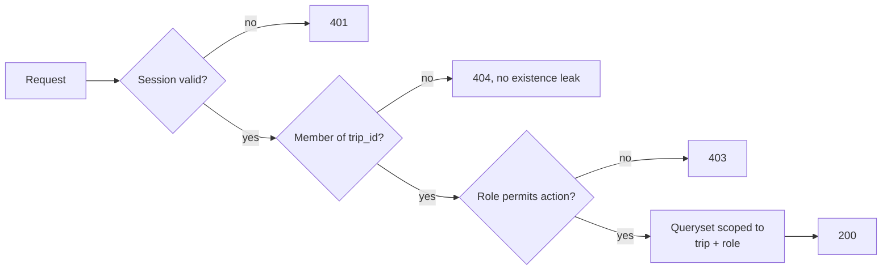

# SECURITY.md: offsiteiq Security Requirements and Secure Coding Standard

Version: 0.2 (2026-10-01)
Status: DRAFT. This file is the single source of security requirements (`SEC-*`, `NFR-SEC-*`), controls, and the threat model. On security matters it wins over every other spec file. Requirement IDs (for example `SEC-AUTHZ-04`) show which requirement each rule serves. Items marked `OPEN` need confirmation before implementation.

Section 3 requirements apply system-wide. Sections 4 and 5 are the coding standard for the Django core API (`api/`) and the React front end (`web/`); section 6 covers the AWS infrastructure. The FastAPI search service (`search/`) is covered where it touches these.

The words MUST, MUST NOT, and SHOULD are used as in RFC 2119. A MUST that cannot be met needs a written exception approved in the pull request.

## 1. Threat model summary

| Asset | Threat | Primary control |
|---|---|---|
| Employee home locations, travel details | Cross-trip or cross-participant disclosure (IDOR) | Queryset scoping by Trip membership and role on every view (§4.4) |
| Trip budgets and aggregate costs | Participant reading Organizer-only data | API omits fields by role; UI hiding is cosmetic (§4.4, §5.4) |
| Session | Theft via XSS, CSRF, fixation | HttpOnly cookie, CSRF tokens, strict CSP, session cycling (§4.3, §4.7, §5.6) |
| Provider credentials | Leak from source, logs, or the client | Secrets Manager; held only by the search service (§4.10) |
| Provider and venue content | Stored XSS, oversized or malformed payloads | Schema validation, size limits, text-only rendering (§4.5, §5.1) |
| Audit trail | Tampering or loss | Insert-only DB role, separate log group (§4.6, §4.11) |

Trust boundaries: browser → CloudFront/ALB → Django; Django/Celery → FastAPI; FastAPI → Providers (topology in [ARCHITECTURE.md](ARCHITECTURE.md) §2–3). Everything that crosses a boundary inbound is untrusted, including Provider responses (`SEC-INPUT-01`) and anything the SPA sends.

## 2. Dependencies and patching

- Dependencies are locked (`uv`/`pip-tools`, `pnpm`), reviewed for CVE history and maintenance before adoption, scanned in CI, and covered by a CycloneDX SBOM per build (`SEC-INTEG-05`). Dependabot raises update PRs. Remove unused dependencies.
- Stay on a supported release line. Plan the next Django migration before 6.1 extended support ends in December 2027.
- Security patch releases for Django, DRF, React, and the OIDC library are applied within 7 days; critical ones within 48 hours. `OPEN`: confirm SLAs.

## 3. Security requirements

Aligned to OWASP ASVS 5.0.

### 3.1 Authentication and session management

| ID | Requirement | ASVS ref |
|----|-------------|----------|
| SEC-AUTH-01 | Authentication SHALL be delegated to the company identity provider via OIDC. No local password store. | V6 |
| SEC-AUTH-02 | Authorization code flow with PKCE SHALL be used. Implicit flow is prohibited. Follow RFC 9700. | V10 |
| SEC-AUTH-03 | Session tokens SHALL be stored in HttpOnly, Secure, SameSite=Lax (or Strict) cookies. | V7 |
| SEC-AUTH-04 | Sessions SHALL expire after an idle timeout and an absolute timeout. Values `OPEN`. | V7 |

### 3.2 Authorization

| ID | Requirement | ASVS ref |
|----|-------------|----------|
| SEC-AUTHZ-01 | The system SHALL enforce role-based access with at least two roles: Organizer and Participant. | V8 |
| SEC-AUTHZ-02 | Only an Organizer of a Trip SHALL view budgets, aggregate costs, and other Participants' travel details. | V8 |
| SEC-AUTHZ-03 | A Participant SHALL view only their own travel details and shared events. | V8 |
| SEC-AUTHZ-04 | Every data access SHALL be authorized server-side by Trip membership and role. Client-side checks are not sufficient. | V8 |
| SEC-AUTHZ-05 | Direct object references (trip IDs, participant IDs) SHALL be unguessable (UUIDv4 or equivalent) and access-checked on every request. | V8 |

### 3.3 Input validation and output encoding

| ID | Requirement | ASVS ref |
|----|-------------|----------|
| SEC-INPUT-01 | All inputs (user and Provider responses) SHALL be validated against an explicit schema before use. Provider responses are untrusted. | V2 |
| SEC-INPUT-02 | All output to HTML, JSON, logs, and exports SHALL be contextually encoded. | V3 |
| SEC-INPUT-03 | Database access SHALL use parameterized queries exclusively. | V2 |
| SEC-INPUT-04 | Location and venue data returned from Providers SHALL be treated as untrusted content and never rendered as HTML. | V3 |

### 3.4 Data protection and privacy

| ID | Requirement | ASVS ref |
|----|-------------|----------|
| SEC-DATA-01 | Employee home locations and travel details are personal data. Collection SHALL be limited to what the trip search requires (see `FR-PART-05` in [REQUIREMENTS.md](REQUIREMENTS.md)). | V14 |
| SEC-DATA-02 | Personal data SHALL be encrypted in transit (TLS 1.2 minimum, TLS 1.3 preferred) and at rest. | V9, V11 |
| SEC-DATA-03 | Trip data SHALL have a defined retention period after Trip end date, after which it is deleted. Period `OPEN`. | V14 |
| SEC-DATA-04 | Logs SHALL NOT contain personal data (including home locations and travel details), budgets, Provider or other credentials, session cookies, CSRF tokens, OIDC tokens, or nonces. | V16 |
| SEC-DATA-05 | `OPEN`: confirm whether any Participants are in jurisdictions with specific data residency requirements. | V14 |

### 3.5 Third-party integrations and secrets

| ID | Requirement | ASVS ref |
|----|-------------|----------|
| SEC-INTEG-01 | Provider API credentials SHALL be stored in a secrets manager, never in source, config files, or environment files committed to version control. | V11 |
| SEC-INTEG-02 | Each Provider integration SHALL use a dedicated credential with the minimum scope the Provider supports. | V11 |
| SEC-INTEG-03 | Outbound Provider calls SHALL have timeouts, retry limits, and circuit breakers so one failing Provider cannot block search. | V13 |
| SEC-INTEG-04 | Provider responses SHALL be size-limited and schema-validated before parsing. | V2, V13 |
| SEC-INTEG-05 | All third-party libraries SHALL be reviewed for CVE history and maintenance status before adoption, with transitive dependencies analyzed. A software bill of materials SHALL be generated per build. | V15 |

### 3.6 Logging and monitoring

| ID | Requirement | ASVS ref |
|----|-------------|----------|
| SEC-LOG-01 | Authentication events, authorization failures, budget overrides, and Itinerary changes SHALL be logged with actor, timestamp, and affected Trip ID. | V16 |
| SEC-LOG-02 | Logs SHALL be write-once from the application's perspective. | V16 |

### 3.7 Verification

| ID | Requirement | Verification |
|----|-------------|--------------|
| NFR-SEC-01 | CI SHALL run SAST and dependency scanning on every pull request, and block merge on high or critical findings. | CI gate (§7.1). |

## 4. Django (core API)

### 4.1 Production settings

- `DEBUG = False`. `manage.py check --deploy` runs in CI against the deployed settings module and any warning fails the build.
- Production runs under gunicorn/uvicorn behind the ALB. `manage.py runserver` MUST NOT serve production traffic.
- `SECRET_KEY`, database credentials, Redis auth token, and the service-token signing key come from AWS Secrets Manager at runtime, never from source, `.env` files, templates, or logs (`SEC-INTEG-01`).
- `SECRET_KEY_FALLBACKS` is empty except during a time-boxed rotation. Remove old keys once every session and signed value that depends on them has expired.
- Use Django's built-in sessions, CSRF, signing, ORM, and security middleware rather than custom equivalents.

### 4.2 Hosts, proxies, and request limits

- `ALLOWED_HOSTS` lists the exact production hostnames. No wildcards.
- Read the host with `request.get_host()`, never from `request.META` or forwarding headers directly.
- Set `SECURE_PROXY_SSL_HEADER` only because the ALB overwrites `X-Forwarded-Proto`; document this in settings. Leave `USE_X_FORWARDED_HOST = False`.
- Keep `DATA_UPLOAD_MAX_MEMORY_SIZE`, `DATA_UPLOAD_MAX_NUMBER_FIELDS`, and `DATA_UPLOAD_MAX_NUMBER_FILES` bounded, with matching limits at the ALB.
- Treat `MultiPartParserError` as a rejected request. Never retry with a more permissive parser.
- Where a parameter is security-relevant (IDs, roles, amounts), reject duplicate values rather than silently picking one.

### 4.3 Authentication and sessions (`SEC-AUTH-*`)

- With no local password store (`SEC-AUTH-01`), `AUTH_PASSWORD_VALIDATORS` and password-reset flows are not used. Do not add them.
- Validate the ID token `iss`, `aud`, `exp`, `nonce`, and signature; validate `state` (`SEC-AUTH-02`). Map the IdP subject to `Employee` by stable subject ID, not email.
- After a successful OIDC callback, call `login(request, user)` with the explicit user object. Django 6.1 no longer falls back to `request.user` when `user` is `None`.
- Rate-limit the login initiation and callback endpoints.
- Sessions are server-side in Redis (`SESSION_ENGINE` cache or cache_db backend). Do not use signed-cookie sessions.
- Session settings (`SEC-AUTH-03`, `SEC-AUTH-04`):

```python
SESSION_COOKIE_SECURE = True
SESSION_COOKIE_HTTPONLY = True
SESSION_COOKIE_SAMESITE = "Lax"
SESSION_SERIALIZER = "django.contrib.sessions.serializers.JSONSerializer"
SESSION_COOKIE_AGE = ...          # absolute timeout, OPEN
# idle timeout enforced by middleware that tracks last activity, OPEN
CSRF_COOKIE_SECURE = True
SIGNED_COOKIE_LEGACY_SALT_FALLBACK = False
```

- Call `logout()` on sign-out. Call `request.session.cycle_key()` after any privilege change (for example, a user being made Organizer of a Trip while signed in).
- Use deny-by-default `LoginRequiredMiddleware` (after `AuthenticationMiddleware`). Only the health check and OIDC endpoints carry `login_not_required`, and each one is reviewed.
- Do not use `RemoteUserMiddleware`.

### 4.4 Authorization (`SEC-AUTHZ-*`)

Authentication is never authorization. Every request follows this flow:



- Every DRF view sets `permission_classes` explicitly. The project default is `IsAuthenticated` plus a Trip-membership permission; `AllowAny` is forbidden outside the reviewed public endpoints.
- Scope the queryset before lookup. `get_object_or_404()` does not check ownership.

```python
# Correct: lookup inside the caller's trips
def get_queryset(self):
    return Trip.objects.filter(memberships__employee=self.request.user.employee)

# Wrong: any authenticated user can fetch any trip by UUID
Trip.objects.get(pk=kwargs["pk"])
```

- Organizer-only data is excluded by role-specific serializers, not by asking the client to hide it (`SEC-AUTHZ-02`, `SEC-AUTHZ-03`).
- Apply the same checks in Celery tasks, management commands, admin actions, and export endpoints, not just in views.
- Use canonical `"app_label.codename"` strings with `has_perm()`. Never build permission names from request data.
- Django admin is limited to the operator group behind IdP login. Restrict `ModelAdmin.get_queryset()` and `has_*_permission()`; wrap custom admin views with `AdminSite.admin_view()`.

### 4.5 Input validation and model binding (`SEC-INPUT-01`)

- All request bodies bind to DRF serializers (or Django forms). Call `is_valid(raise_exception=True)` and use only `validated_data`.
- Serializers declare an explicit `fields` allowlist. `fields = "__all__"` and `exclude` are forbidden.
- Server-controlled fields are never writable from the request: `trip_id` on child objects, `organizer`, `role_code`, `created_by`, approval or override state, Provider prices, job status, and `fetched_at`. Mark them `read_only` and set them in `perform_create()`/`save(commit=False)`.
- Budget amounts are `DecimalField` with explicit `max_digits`/`decimal_places` and a currency from the lookup table (`FR-TRIP-06`).
- Call `full_clean()` on models created outside serializers before saving when they cross a trust boundary.
- Provider data arriving from the search service is re-validated by the worker before persisting, even though FastAPI already validated it with Pydantic.

### 4.6 Database access (`SEC-INPUT-03`)

- Use the ORM. Raw SQL (`raw()`, `cursor.execute()`, `RawSQL`, `extra()`) is banned by lint rule except in reviewed migrations, and there values are passed as parameters.
- Never interpolate request data into table names, column names, `order_by()`, aliases, or SQL fragments. Map sort fields through an allowlist.
- Scope `update()`, `delete()`, `in_bulk()`, and bulk operations by Trip before executing them.
- Audit emission and retention cleanup MUST NOT depend only on `pre_delete`/`post_delete` signals; database-level cascades (`DB_CASCADE`) bypass them. The retention purge (`SEC-DATA-03`) is an explicit service operation that writes its own audit record.
- `itinerary_item_version` is insert-only at the database role level (`FR-ITIN-06`). Do not grant `UPDATE`/`DELETE` to `app_rw` on it.
- Separate DB roles: `app_migrator` (DDL, used only by the migration task), `app_rw` (Django and worker), `app_ro` (reporting). The search service has no DB credentials.

### 4.7 CSRF

- `CsrfViewMiddleware` stays enabled. DRF uses `SessionAuthentication`, which enforces CSRF on unsafe methods.
- The SPA reads the `csrftoken` cookie and sends it in `X-CSRFToken` (§5.5). `CSRF_TRUSTED_ORIGINS` lists only the exact SPA origin with scheme.
- GET, HEAD, and OPTIONS MUST NOT change state.
- `csrf_exempt` is forbidden except on the OIDC callback if the library requires it, which is protected by `state` validation instead.
- CORS, `SameSite`, and "POST-only" are not substitutes for CSRF tokens.

### 4.8 Output, headers, and CSP (`SEC-INPUT-02`)

- The API returns JSON through DRF's renderer. Do not build JSON or HTML by string concatenation.
- For the few server-rendered pages (admin, OIDC error page): keep autoescaping on; use `format_html()` for fixed markup; `mark_safe`, `|safe`, and `` require review; never compile user-supplied templates; use `json_script` to pass data to JavaScript; never treat `strip_tags()` as sanitization.
- The SPA's CSP is set at CloudFront. For Django-served responses, enable `ContentSecurityPolicyMiddleware` with an enforced `SECURE_CSP` built from constants (an empty `{}` emits nothing, and report-only blocks nothing). If a policy uses `CSP.NONCE`, add the `csp` context processor and treat `security.W027` as a build failure.
- `SecurityMiddleware` sits near the top of `MIDDLEWARE` with `SECURE_CONTENT_TYPE_NOSNIFF = True`. Keep `XFrameOptionsMiddleware` unless CSP `frame-ancestors 'none'` is set.
- HTTPS redirect at the ALB/CloudFront and `SECURE_SSL_REDIRECT = True`. Raise HSTS gradually once every host is HTTPS-only.
- Production errors are generic. Use `sensitive_variables` and `sensitive_post_parameters` where error reports could capture personal data or budgets.

### 4.9 Redirects, exports, and outbound calls

- Validate any request-controlled redirect (for example, `next` after login) with `url_has_allowed_host_and_scheme()` and an explicit host list, requiring HTTPS.
- Do not enable `RedirectView.preserve_request` without review.
- Django does not fetch user-supplied URLs. If that ever changes, allowlist schemes and hosts, resolve and block private and metadata addresses, and re-check after every redirect. `URLValidator` is not an SSRF defense.
- Itinerary exports (`FR-ITIN-05`, format `OPEN`) are built with a library that escapes for the target format (ICS text escaping, PDF generation without HTML from untrusted data). Exports pass the same authorization as the view they represent.
- Roster CSV import (`FR-PART-04`, `OPEN`): enforce size and row limits, validate each row through a serializer, and neutralize spreadsheet formula prefixes (`=`, `+`, `-`, `@`) in any CSV the system later exports.
- If uploads are added, generate storage names server-side, stream with `chunks()`, validate actual content, and serve from a separate domain.

### 4.10 Secrets, signing, caching, and tasks

- Signing uses `TimestampSigner` with a distinct salt per purpose and a required `max_age`. Signing gives integrity, not secrecy.
- Never unpickle data from requests, Redis, task results, or the database. Do not use `DatabaseCache`. Celery is configured with `task_serializer = "json"` and `accept_content = ["json"]`.
- Celery tasks receive IDs only, then reload and re-authorize records in the worker. Enqueue database-dependent tasks with `transaction.on_commit()`. Side effects are idempotent. Search job status lookups are authorized by user and Trip; a job ID is not authority.
- Bound worker queues, retries, payload size, concurrency, and execution time.
- Sensitive responses use `never_cache`. Any cached response or fragment is keyed by user and Trip, and authorization runs before the cache is read.
- The worker calls FastAPI with a short-lived signed service token over TLS on the private network. Provider credentials live only in the search service (`SEC-INTEG-01`, `SEC-INTEG-02`); Django has none.
- Outbound calls from Django and the worker set explicit connect and read timeouts.

### 4.11 Logging (`SEC-LOG-*`, `SEC-DATA-04`)

- `SEC-LOG-01` events also carry the request ID and go to a separate security log group with longer retention.
- A log filter strips personal data, budgets, and credentials before emit (`SEC-DATA-04`). It is a backstop, not a license to log raw objects.
- Encode or strip CR/LF and control characters from logged user and Provider values.
- Monitor `django.security`, CSRF failures, `DisallowedHost`, authorization denials, and signature failures.

## 5. React (web front end)

offsiteiq is a client-rendered Vite SPA. It does not use React Server Components, Server Functions, or SSR, so the React 19 rules for `'use server'`, `bootstrapScriptContent`, and hydration do not apply. If SSR or Server Functions are ever adopted, this section MUST be revised first: every Server Function is then a public endpoint requiring its own authentication, authorization, validation, and CSRF protection.

### 5.1 Rendering untrusted data (`SEC-INPUT-02`, `SEC-INPUT-04`)

- Render all user, Provider, and venue data as JSX text: `<p>{venue.description}</p>`. React escapes it.
- `dangerouslySetInnerHTML` is forbidden and blocked by ESLint (`react/no-danger`). There is no rich-HTML requirement. If one appears, it needs a design review, a maintained allowlist sanitizer (DOMPurify) applied once immediately before the sink, and no concatenation after sanitizing.
- No direct DOM HTML sinks: `innerHTML`, `outerHTML`, `insertAdjacentHTML`, `document.write`, `eval`, `new Function`, or string-form `setTimeout`. Direct DOM work goes through a reviewed helper.
- Do not put untrusted data in inline `style` strings, raw SVG markup, or event-handler strings.
- Treat HTML-rendering props of third-party components (rich text, map popups, tooltips) as dangerous sinks and pass text only.

### 5.2 URLs and props

- Any URL from Provider or venue data (booking links, venue websites, images, map links) passes `safeUrl()` in `web/src/lib/` before use in `href`, `src`, or `action`: parse with `new URL()`, allow only `https:`, and for images allow only approved origins.

```tsx
const href = safeUrl(venue.websiteUrl);           // returns undefined if not https
{href && <a href={href} target="_blank" rel="noopener noreferrer">{venue.name}</a>}
```

- Never spread untrusted objects onto DOM elements or privileged components (`<div {...providerData} />`).
- Choose components from user-influenced values through an explicit map, not dynamic `import()` or property lookup.
- `preinit`/`preinitModule` take only build-time constants.
- No `<iframe>` with user-derived `src`.

### 5.3 Secrets and environment

- Anything in `import.meta.env.VITE_*` is public. No secrets, Provider keys, or internal URLs in the bundle.

### 5.4 Client state is untrusted

- Route params, query strings, React state, context, TanStack Query cache, and browser storage are attacker-controlled. The API decides access every time (`SEC-AUTHZ-04`).
- Hiding a budget or another Participant's details in the UI is cosmetic; the API must not send it (`SEC-AUTHZ-02`).
- No tokens or personal data in `localStorage`, `sessionStorage`, or IndexedDB. Authentication relies only on the HttpOnly session cookie (`SEC-AUTH-03`).
- On logout, session expiry (401), or switching trips, call `queryClient.clear()` and reset user-specific state.
- Ignore stale responses: key queries by Trip ID and user so a slow response for Trip A cannot render under Trip B.

### 5.5 Talking to the API

- Use the typed client in `web/src/api/` generated from the Django OpenAPI schema. Requests go same-origin with `credentials: "same-origin"`.
- Send `X-CSRFToken` on every POST, PUT, PATCH, and DELETE.
- Zod validation in forms is for UX only; the server re-validates everything.

### 5.6 CSP and headers

- CloudFront sets a strict CSP: `script-src 'self'` with no `unsafe-inline` or `unsafe-eval`, `object-src 'none'`, `base-uri 'none'`, `frame-ancestors 'none'`, `connect-src` limited to the API origin, and `img-src` limited to self plus approved Provider image hosts. Add `require-trusted-types-for 'script'` once third-party libraries are compatible. Trusted Types does not make sanitized HTML safe by itself.
- The CloudFront response headers policy also sets HSTS, `X-Content-Type-Options: nosniff`, and `Referrer-Policy`.
- The Vite build emits no inline scripts. Fonts are self-hosted.

### 5.7 Errors and dependencies

- Error boundaries show a generic message and a correlation ID; never stack traces, raw API errors, or Provider responses.
- `react` and `react-dom` versions match exactly.

## 6. Infrastructure (AWS)

- Each environment is a separate AWS account. Dev holds no production or real employee data; seed data is synthetic.
- Human access via IAM Identity Center (SSO) with MFA. No IAM users or long-lived access keys. CI deploys via GitHub Actions OIDC federation into a scoped deploy role.
- Guardrails: CloudTrail (org trail), GuardDuty, AWS Config, Security Hub, IAM Access Analyzer.
- TLS 1.2+ at CloudFront and ALBs; TLS to RDS (`rds.force_ssl = 1`) and to Redis with an auth token (`SEC-DATA-02`).
- RDS is encrypted with a customer-managed KMS key, has no public access, and sits in private data subnets (`SEC-DATA-02`).
- The search service is reachable only on the private network through the internal ALB. It accepts only Django/worker calls bearing a short-lived signed service token (§4.10).
- Security groups are allow-lists, deny by default:

| Source | Destination | Port |
|---|---|---|
| CloudFront managed prefix list | Public ALB | 443 |
| Public ALB | Django tasks | 8000 |
| Django + worker tasks | Internal ALB → FastAPI tasks | 443 → 8001 |
| Django + worker tasks | RDS | 5432 |
| Django, worker, FastAPI tasks | ElastiCache | 6379 (TLS, AUTH) |
| FastAPI tasks | NAT → Providers | 443 |

## 7. Verification

### 7.1 CI gates (`NFR-SEC-01`)

- `manage.py check --deploy` passes with production settings.
- SAST: Semgrep (Django and React rulesets) and Bandit; high and critical findings block merge.
- Dependency scan for pip and pnpm lockfiles; high and critical CVEs block merge.
- ESLint with `react/no-danger`, `no-eval`, `no-implied-eval`, and a rule banning `innerHTML` assignments.
- Secret scanning (gitleaks) on every push.

### 7.2 Required tests

- Authorization matrix per endpoint: anonymous, Participant of the Trip, Organizer of the Trip, member of a different Trip, operator. Cases include a Participant fetching another Participant's details, a member of Trip A fetching Trip B by UUID, a Participant reading budget fields, and each Organizer-only write as a Participant.
- Mass assignment: posting `role_code`, `organizer`, `trip`, prices, or job status is ignored or rejected.
- CSRF: unsafe requests without `X-CSRFToken` fail.
- XSS: Provider and venue strings containing `<script>`, ``, and `javascript:` URLs render as inert text and links are dropped.
- Duplicate parameters, malformed multipart bodies, oversized bodies, and oversized Provider responses are rejected.
- Open redirect: external, scheme-relative (`//evil`), and encoded `next` values are refused.
- Session: ID changes at login and privilege change; logout invalidates server-side; idle and absolute timeouts fire.
- Logging: security events emitted with required fields; no personal data or budgets in captured logs.
- Retention purge deletes expired Trips and writes an audit record.
- Celery: tasks reject jobs for Trips the requesting user no longer has access to.

### 7.3 Code review checklist

Every occurrence of the following in a diff gets explicit reviewer sign-off:

- Django: `csrf_exempt`, `AllowAny`, `login_not_required`, `mark_safe`, `|safe`, `autoescape off`, `raw(`, `cursor.execute`, `RawSQL`, `extra(`, `fields = "__all__"`, `exclude =`, unscoped `.objects.get(`/`.objects.all()` in views, `pickle`, `request.META` forwarding headers, `ALLOWED_HOSTS` changes, `DB_CASCADE`, `preserve_request`, `DEBUG`, new `MIDDLEWARE` ordering.
- React: `dangerouslySetInnerHTML`, `innerHTML`, `eval`, `new Function`, `href=`/`src=` from data without `safeUrl()`, `{...props}` spreads of API data, `localStorage`/`sessionStorage`, `VITE_` variables, new third-party components that render HTML.

## 8. Reporting a vulnerability

Report suspected vulnerabilities privately to the maintainers through GitHub Security Advisories on this repository ("Report a vulnerability"). Do not open public issues for security problems. `OPEN`: confirm a security contact address and response-time commitment.
